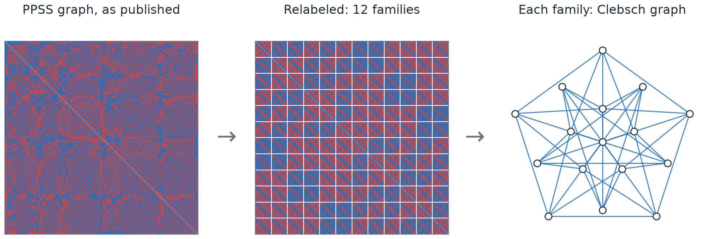

# Twelve Clebsch graphs and the Ramsey multiplicity of K₄



**A new upper bound for the Ramsey multiplicity of K₄, c₄ ≤ 0.0301388876.**
The previous best public construction is a 768-vertex graph with no visible
pattern. We show that it is twelve linked copies of the Clebsch graph, then
refine that structure into a better coloring.

[Paper (PDF)](paper/main.pdf) · [Introduction](introduction.md) ·
[Interactive explainer](explainer/clebsch-explorer.html) · [Paper build notes](paper/README.md)

## The result

Color every edge of a large complete graph red or blue. c₄ is the smallest
possible fraction of four-vertex sets whose six edges all share a color, in the
limit of large graphs. Random coloring gives 1/32 = 0.03125; the true value is
unknown and is at least 0.0296.

| Construction | Upper bound on c₄ | Status |
|---|---:|---|
| Parczyk, Pokutta, Spiegel, Szabó (PPSS), 2022 | 0.0301449 | Published; graph public |
| McKay, reported by PPSS, 2024 | 0.0301423 | Value reported; graph not released |
| Feinstein, Technion seminar, Jan 2026 | < 0.030139 | Announced; no value or construction |
| **This work** | **0.0301388876** | Exact value; data, code, and proofs here |

Our bound is below Feinstein's announced threshold. Without his exact value we
can't compare the two, so we don't claim to beat it. The exact value is

```text
8450462766487926638466333426306607129 / 280384030360880691940646801777885184000
```

## How it works

1. **Hidden structure.** The PPSS graph's vertices split into 12 families of
   64. Inside each family the blue edges form the Clebsch graph, with every
   vertex replaced by four. Between families, the colors follow one of four
   patterns, chosen by a simple rule on ℤ₃ × ℤ₂ × ℤ₂.
2. **Two parameters.** Making the two fractional patterns adjustable gives a
   192-class construction whose density is an explicit polynomial in p and h.
   Its minimum, 0.0301389773, already beats McKay's value. A nearby rational
   point, 0.0301389941, is proved in Lean.
3. **Refinement.** Splitting each class with a pentagon pattern, then twice into
   balanced ± halves, gives 3840 classes and the bound above. The bound is
   proved in Lean and confirmed by an independent exact computation.


## How it was found

The construction was found autonomously by an AI research system running in
[Codex](https://github.com/openai/codex), OpenAI's agent harness. A
[GPT-6 Astra](https://deploymentsafety.openai.com/gpt-6-astra) parent agent
directed eight GPT-6 Astra subagents through Codex's native subagents. Every
agent followed a [research skill](paper/data/research-workflow.md) derived from
OpenAI's [Cycle Double Cover prompt](https://cdn.openai.com/pdf/04d1d1e4-bc75-476a-97cf-49055cd98d31/cdc_prompt.pdf)
and the [Jacobian Conjecture prompt](https://aaronlou.com/jacobian_counterexample_prompt.pdf)
([adaptation notes](paper/data/workflow-source-principles.md)). No candidate was
accepted until a separate program had recounted it exactly.

## Authors

- Luke Van Seters
- Madhan Jothimani

## Citation

```bibtex
@misc{vanseters2026clebsch,
  author = {Van Seters, Luke and Jothimani, Madhan},
  title  = {Twelve {Clebsch} Graphs and a New Upper Bound for the {Ramsey} Multiplicity of {$K_4$}},
  year   = {2026},
  url    = {https://github.com/lukevs/k4-ramsey}
}
```

## Acknowledgments

This work began at [Sundai Hack 142](https://www.sundai.club/events/boston/recursive-learning-hack-with-harvard-innovation-labs),
*Recursive Self Improvement and Formal Verification in Mathematics* (Harvard,
27 September 2026). Huge thanks to the Sundai Club organizers: without the
event, this work would not exist. Special thanks to Alejandro Zarzuelo
Urdiales, a guest at the event, who selected the open problems for the hack and
presented them; this problem was one of them.

## Using this repository

### Layout

| Folder | What's there |
|---|---|
| `paper/` | The paper, its figures, and the construction data |
| `lean/` | Lean proofs |
| `src/k4_ramsey/` | Python code: search, checking, and paper tools |
| `native/` | The C++ search engine |
| `explainer/` | The interactive explainer |
| `data/` | The PPSS graph and fixed inputs |
| `research/` | Notes and experiments from the research campaign |
| `docs/` | Details on verification and running experiments |
| `tests/` | Tests |

Generated output (`reports/`, `build/`, `lean/.lake/`, `journal.html`) is not
checked in. The [research index](research/README.md) maps paths in the older
notes to their current locations.

### Setup

You need macOS or Linux with Git, [just](https://github.com/casey/just),
[uv](https://docs.astral.sh/uv/), Lean's [elan](https://github.com/leanprover/elan),
and a C++17 compiler.

```sh
git clone https://github.com/lukevs/k4-ramsey.git
cd k4-ramsey
just setup
```

This installs the Python environment and Lean's math library (mathlib), checks
the proofs, and builds the C++ engine. Allow several GB of disk space. After
that, run everything through `just` from the repository root; `just` on its own
lists the commands.

### Common commands

**Check the results**

| Command | What it does |
|---|---|
| `just check` | Build everything, run the tests, and list what the Lean proofs depend on |
| `just published` | Count monochromatic K₄s in the PPSS graph with a fast Lean program |
| `just recount` | Recount the 3840-class construction (several minutes, about 700 MB) |
| `just audit` | List the axioms and native evaluations each Lean theorem depends on |

**The paper**

| Command | What it does |
|---|---|
| `just paper-check` | Check the paper's construction data |
| `just paper-figures` | Redraw the figures from the published data |
| `just paper` | Check, redraw, and compile the PDF (needs LaTeX) |

**Search and development**

| Command | What it does |
|---|---|
| `just search reports/run-001` | Run a short search starting from the PPSS graph |
| `just runner-help run` | Show options for longer experiments |
| `just dashboard` | Refresh the local experiment dashboard, `journal.html` |
| `just build`, `just test` | Build, or run the tests |
| `just format`, `just python-lint` | Format or lint the Python code |
| `just explainer` | Rebuild the interactive explainer (needs Node.js) |
| `just native-test` | Test the C++ engine with memory-safety checks |
| `just generate-final3840` | Regenerate the Lean copy of the 3840-class construction |

Each search needs a new output directory. Don't rebuild while a search is
running.

### Verification status

- The 192-class bound (0.0301389941) has a complete Lean proof, including the
  numerical evaluation.
- The 3840-class bound (0.030138887566497220…) also has a complete numerical
  Lean certificate, connected to the literal density and finite-coloring
  existence theorem. Run `just certify-final3840` to check it. Both numerical
  certificates use `native_decide`, trusting Lean's compiler and runtime.
- The fast program behind `just published` agrees with the PPSS value, but no
  Lean proof yet connects it to the definition of the density.

See [verification details](docs/verification.md),
[running experiments](docs/experiments.md), and
[where the PPSS graph comes from](data/SOURCE.md).
