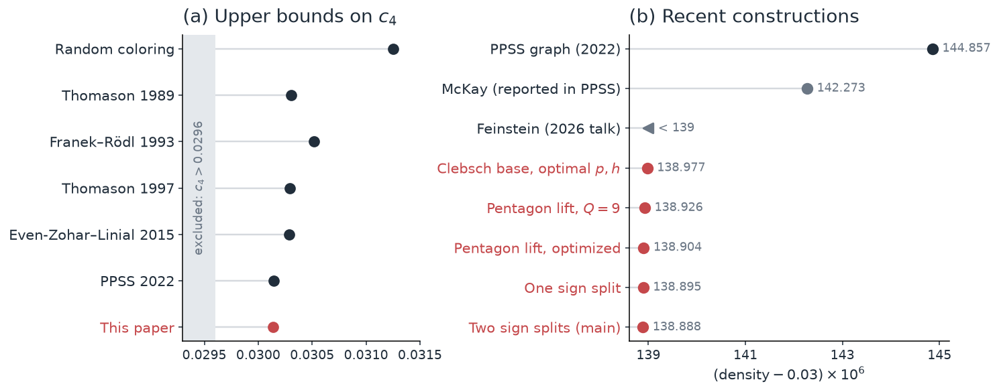
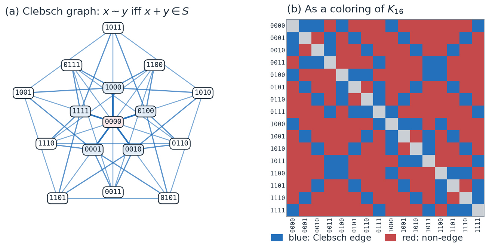
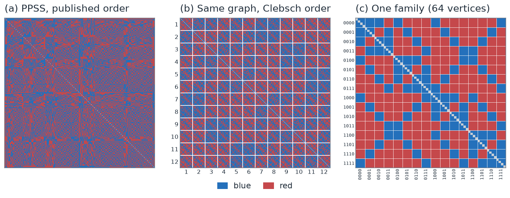
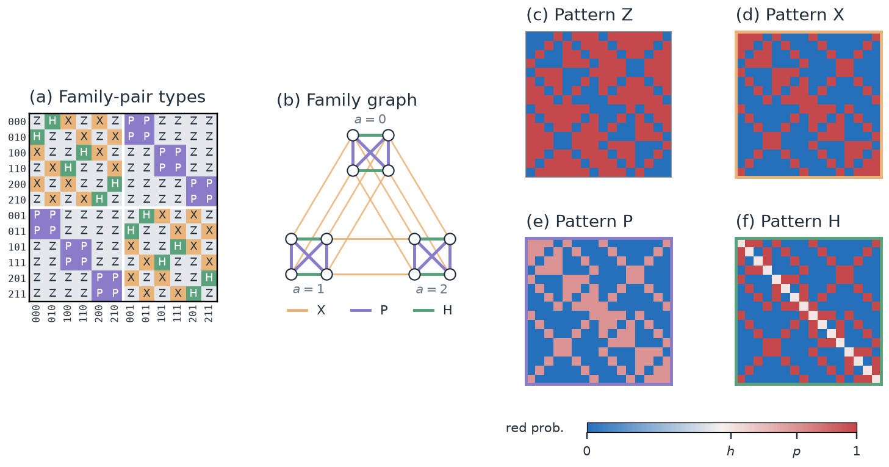
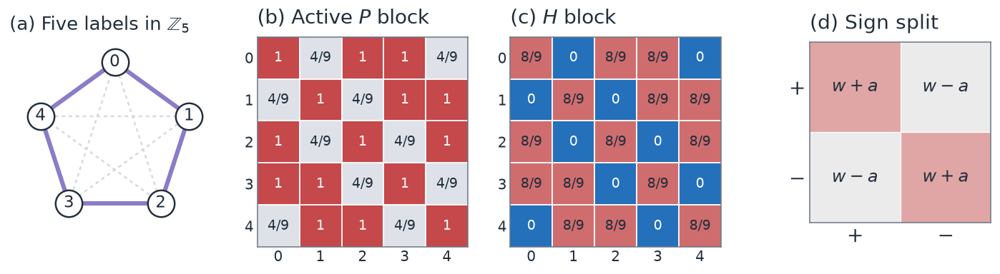

# Twelve Clebsch graphs: an introduction

This note explains the project for readers with some probability and calculus but no graph theory. The full mathematical treatment is in [the paper](paper/main.pdf).

**In short.** We find a new best explicit upper bound for the Ramsey multiplicity of K₄, c₄ ≤ 0.0301388876. We get there by showing that the previous best public construction is made of twelve linked copies of the Clebsch graph, then refining that structure. The work was done autonomously by an AI research system.

## 1. The question

Take a large number of points and join every pair by an edge, colored red or blue. Pick any four points. They are joined by six edges, and if all six are the same color we call the four points a **monochromatic K₄**.

> How small can the fraction of monochromatic four-point sets be, as the number of points grows?

The limiting answer is a constant called **c₄**. Nobody knows its exact value.

A natural first guess is to color each edge with a fair coin. Each four-point set is then all-red with probability (1/2)⁶ = 1/64 and all-blue with probability 1/64, so the fraction is 1/32 = **3.125%**. Erdős conjectured in 1962 that nothing beats this. Thomason showed in 1989 that structured colorings do better, and since then the record has been pushed down step by step.

There are two kinds of progress:

- An **upper bound** comes from building a good coloring. If a coloring achieves fraction U, then c₄ ≤ U.
- A **lower bound** comes from proving that every coloring has at least some fraction L. The best known is c₄ ≥ 0.0296, from computer-assisted "flag algebra" calculations.

This project is about upper bounds: building better colorings.



## 2. Where things stood

Three recent results define the frontier:

| Result | Value | Status |
|---|---:|---|
| Parczyk, Pokutta, Spiegel, Szabó (PPSS), 2022 | 0.0301449 | Published, with the 768-point graph publicly available |
| McKay, reported in the PPSS paper (2024 revision) | 0.0301423 | Value reported; the graph has not been released |
| Feinstein, Technion seminar, January 2026 | below 0.030139 | Announced in a talk; no exact value or construction public |
| **This project** | **0.0301388876** | Explicit construction, exact value, data public |

Our value is below the threshold Feinstein announced. Without his exact value we can't tell which construction is better, so we don't claim to beat it.

## 3. Turning a small table into a huge coloring

Our constructions are tables of probabilities, not finite graphs. Divide the points into N groups. For each pair of groups, the table says how likely an edge between them is to be red. Assign each point to a random group, then color every edge independently using the table.

The expected fraction of monochromatic four-point sets can be computed exactly from the table. Some actual coloring is at least as good as the average, so every table gives an upper bound on c₄, however many points we use. Mathematicians call such a table a **step graphon**. A finite graph is the special case where every entry is 0 or 1.

## 4. The Clebsch graph

The **Clebsch graph** has 16 vertices, labeled by the binary strings 0000 to 1111. Two strings are joined when they differ in exactly one digit or in all four. For example, the neighbors of 0000 are 1000, 0100, 0010, 0001 and 1111.



Every vertex has five neighbors, and no two neighbors are joined to each other, so the graph has **no triangles**. If we color the Clebsch edges blue and everything else red, there is no blue triangle and so certainly no blue K₄. Red still has plenty of K₄s, though, so one Clebsch coloring alone is a poor answer. What matters is how several copies are combined.

## 5. What's inside the PPSS graph

The PPSS graph has 768 vertices. As a red/blue matrix in its published order (panel a below), it shows little structure.

We found that its vertices can be relabeled so that:

- they split into **12 families of 64**;
- each family splits into **16 groups of 4**, one group per Clebsch vertex;
- inside every family, the colors follow the Clebsch pattern: blue within a group and between Clebsch neighbors, red otherwise (panel c).

Relabeling only reorders the vertices, so the coloring is the same graph.



Between two different families, the colors follow one of just **four patterns**, called Z, X, P and H:

| Pattern | Same Clebsch vertex | Clebsch neighbors | Everything else |
|---|---:|---:|---:|
| Z (same as inside a family) | blue | blue | red |
| X (Z with colors swapped) | red | red | blue |
| P | ¾ red in PPSS → **p** | ¾ red in PPSS → **p** | blue |
| H | ½ red in PPSS → **h** | red | blue |

Which pattern links two families is decided by a simple rule. Label the families by three coordinates (a, e, s) with a ∈ {0,1,2} and e, s ∈ {0,1}. The pattern depends only on how the coordinates differ (panel a below). As a picture (panel b): for each value of a, the four families form a square whose sides and diagonals are P and H links, and the three squares are joined by X triangles.



The [interactive explorer](explainer/clebsch-explorer.html) lets you click through the families and patterns.

## 6. Two knobs

The P and H patterns are the only places where PPSS uses in-between probabilities. Replacing them with adjustable probabilities **p** and **h** gives a 192-group table, B(p, h), with two knobs.

Each monochromatic K₄ involves six edges, so the fraction is a polynomial in p and h of degree six. We computed it exactly and found its minimum with computer algebra:

- p ≈ 0.7792, h ≈ 0.5343,
- fraction ≈ **0.0301389773**.

That already beats McKay's value. The nearby rational choice p = 32/41, h = 22/41 gives 0.0301389941, and this bound is **checked end to end in the Lean proof assistant**.

## 7. Going below the minimum

The minimum above is the best you can do with 192 groups. With more groups you can do better, even if the averages between groups stay the same, because the density depends on how six edges occur together and not only on their averages.

We split groups in two ways:

1. **Pentagon split.** Each group becomes five, arranged around a pentagon. On a P link, pairs that are adjacent on the pentagon get probability 4/9 and the rest get 1, which averages to 7/9. Using only the probabilities 0, 4/9, 7/9, 8/9 and 1 already gives 0.0301389258. Tuning the amplitudes gives 0.0301389036.
2. **Sign splits.** Each group becomes a "+" half and a "−" half. A link with probability w becomes w + a within matching signs and w − a across them. The average is still w. Doing this twice gives 3840 groups.



The final table has 3840 groups and exact value

```text
U = 8450462766487926638466333426306607129 / 280384030360880691940646801777885184000
  = 0.030138887566497220…
```

Why could a plain second-derivative test not find these improvements? For a sign split, averaging over the signs cancels every first- and second-order change. The first effect is third order, coming from triangles of changed edges. A table that looks like a minimum can therefore still improve once its groups are split.

## 8. How it was found

The research was done by an autonomous AI system running in [Codex](https://github.com/openai/codex), OpenAI's agent harness. Every agent was OpenAI's **[GPT-6 Astra](https://deploymentsafety.openai.com/gpt-6-astra)** model: a parent agent directed eight subagents, created with Codex's native subagents, each pursuing a different line of attack: new constructions, algebra, optimization, literature and verification. The parent kept track of approaches, moved effort toward what worked, and decided which results to keep.

Every agent followed the same [research skill](paper/data/research-workflow.md), a set of standing instructions. We derived it from two public prompts for autonomous mathematical research: OpenAI's [Cycle Double Cover prompt](https://cdn.openai.com/pdf/04d1d1e4-bc75-476a-97cf-49055cd98d31/cdc_prompt.pdf) and the [Jacobian Conjecture prompt](https://aaronlou.com/jacobian_counterexample_prompt.pdf). The skill keeps their emphasis on diverse approaches and adversarial review. It adds falsifiable predictions, exact recounts and experiment records ([adaptation notes](paper/data/workflow-source-principles.md)).

The agents found the fiber structure, the Clebsch rule, the two-knob family, and both refinements in that order. No agent could approve its own result. Every candidate was an explicit matrix of fractions, and it was accepted only after a separate program recounted it exactly.

## 9. How sure are we?

| Claim | Evidence |
|---|---|
| c₄ ≤ 0.0301389941 (192 groups) | Full Lean proof, including the numerical evaluation |
| c₄ ≤ 0.0301388876 (3840 groups) | Independent exact integer computation; Lean checks the structure and counting formula, but the final numerical step isn't formalized yet |
| The PPSS graph has the Clebsch structure | Checked entry by entry every time the figures are generated |
| The two-knob minimum is 0.0301389773 | Exact computer algebra (Gröbner basis, Sturm count, interval arithmetic) |

## 10. What we don't know

- Whether further refinements of the same structure keep helping, or whether a different base does better. In limited tests, removing families hurt and adding families didn't help.
- How our construction relates to Feinstein's, which is described as "structured and symmetric".
- The true value of c₄. The gap between 0.0296 and 0.0301 is far larger than any of the improvements here.
